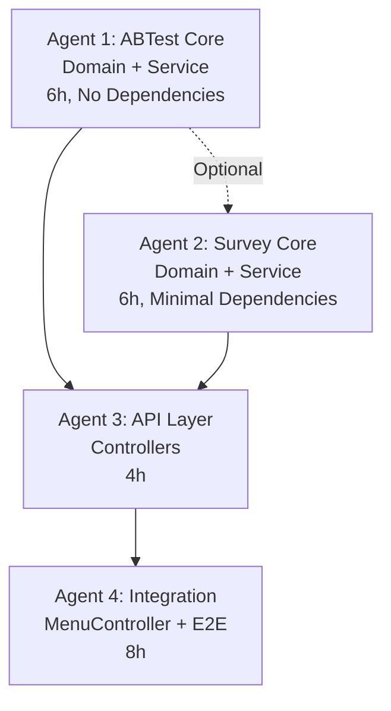

# Agent Specifications for MVP v2 Parallel Implementation

## Purpose

Enable **Agent-Heavy TDD approach** where multiple AI agents work in parallel to implement FoodiePass MVP v2 backend with **50% faster completion** than sequential development.

---

## 🎯 Optimized 4-Agent Architecture

### Agent Dependencies



---

## 📦 Agent Specifications

### Agent 1 (Core): ABTest Module
**File**: [`agent-1-core-abtest.md`](./agent-1-core-abtest.md)

**Scope**:
- Domain layer (ABGroup enum, MenuScan entity)
- Repository layer (MenuScanRepository)
- Service layer (ABTestService)

**Deliverables**:
- `abtest/domain/`, `abtest/repository/`, `abtest/application/`
- Unit tests (>85% coverage)

**Dependencies**: None

**Estimated Time**: 6 hours

**Can Start**: Immediately in parallel with Agent 2

---

### Agent 2 (Core): Survey Module
**File**: [`agent-2-core-survey.md`](./agent-2-core-survey.md)

**Scope**:
- Domain layer (SurveyResponse entity)
- Repository layer (SurveyResponseRepository)
- Service layer (SurveyService)

**Deliverables**:
- `survey/domain/`, `survey/repository/`, `survey/application/`
- Unit tests (>85% coverage)
- H3 hypothesis validation logic

**Dependencies**: ABGroup enum (can use interface contract)

**Estimated Time**: 6 hours

**Can Start**: Immediately in parallel with Agent 1

---

### Agent 3 (API Layer): REST Controllers
**File**: [`agent-3-api-layer.md`](./agent-3-api-layer.md)

**Scope**:
- ABTest Controller (admin analytics)
- Survey Controller (submission + analytics)
- Request/Response DTOs

**Deliverables**:
- `abtest/api/`, `survey/api/`
- Controller unit tests (>85% coverage)

**Dependencies**: ABTestService, SurveyService (can mock during development)

**Estimated Time**: 4 hours

**Can Start**: After Agent 1/2 complete (or parallel with mocks)

---

### Agent 4 (Integration): MenuController & E2E
**File**: [`agent-4-integration.md`](./agent-4-integration.md)

**Scope**:
- Modify MenuController (`POST /api/menus/scan`)
- A/B group integration
- CONTROL vs TREATMENT conditional logic
- Full pipeline integration tests
- E2E tests

**Deliverables**:
- Modified MenuController with new endpoint
- MenuScan DTOs (Request/Response/MenuItemResponse)
- Integration tests (>80% coverage)
- Performance validation (<5s)

**Dependencies**: All previous agents (Agent 1/2/3 + existing MenuService)

**Estimated Time**: 8 hours

**Can Start**: After Agent 1/2/3 complete

---

## 🚀 Execution Strategies

### Strategy A: Maximum Parallelization (Recommended)

**Day 1 (Morning - 6 hours)**:
```bash
# Launch Agent 1 and 2 in parallel
/task @.claude/agents/agent-1-core-abtest.md
/task @.claude/agents/agent-2-core-survey.md

# Optional: Start Agent 3 with mocked services
/task @.claude/agents/agent-3-api-layer.md
```

**Day 1 (Afternoon - 4 hours)**:
```bash
# After Agent 1/2 complete, finalize Agent 3 (if started with mocks)
# Or start Agent 3 fresh with real services
/task @.claude/agents/agent-3-api-layer.md
```

**Day 2 (8 hours)**:
```bash
# After Agent 1/2/3 complete
/task @.claude/agents/agent-4-integration.md
```

**Total Time**: **1.5 days** (vs 3 days sequential)
**Time Savings**: **50% faster** ⚡

---

### Strategy B: Conservative Sequential

**Day 1**:
```bash
/task @.claude/agents/agent-1-core-abtest.md  # 6h
/task @.claude/agents/agent-2-core-survey.md  # 6h (parallel or after Agent 1)
```

**Day 2**:
```bash
/task @.claude/agents/agent-3-api-layer.md  # 4h
/task @.claude/agents/agent-4-integration.md  # 8h (start after Agent 3)
```

**Total Time**: **2 days**

---

## 📋 Interface Contracts

**Important**: All agents should reference [`docs/INTERFACE_CONTRACT.md`](../../docs/INTERFACE_CONTRACT.md) for:
- Service interfaces (ABTestService, SurveyService)
- Data contracts (ABGroup, MenuScan, SurveyResponse)
- REST API contracts (endpoints, JSON schemas)

This enables **parallel development without blocking**.

---

## ✅ Quality Gates

### Before Agent 3 (API Layer)
- [ ] Agent 1 tests pass (ABTest Core)
- [ ] Agent 2 tests pass (Survey Core)
- [ ] Coverage >85% for both modules
- [ ] No compilation errors
- [ ] Services match interface contracts exactly

### Before Agent 4 (Integration)
- [ ] Agent 3 tests pass (Controllers)
- [ ] All REST endpoints match specs
- [ ] Request/Response DTOs validated
- [ ] Error handling tested
- [ ] Coverage >85% for controllers

### Before Merge to Develop
- [ ] Agent 4 tests pass (Integration + E2E)
- [ ] Full pipeline works for CONTROL group
- [ ] Full pipeline works for TREATMENT group
- [ ] Processing time <5 seconds validated
- [ ] A/B distribution is ~50:50
- [ ] Overall coverage >85%
- [ ] All hypothesis requirements met (H1, H2, H3)

---

## 📊 Success Metrics

### Implementation Quality
| Metric | Target | Agent |
|--------|--------|-------|
| Test Coverage | >85% | All |
| Domain Coverage | >90% | 1, 2 |
| Service Coverage | >85% | 1, 2 |
| Controller Coverage | >85% | 3 |
| Integration Coverage | >80% | 4 |

### Performance (H2 Validation)
| Metric | Target | Agent |
|--------|--------|-------|
| Processing Time | <5s | 4 |
| OCR Accuracy | ≥90% | 4 (measured) |
| Currency Accuracy | ≥95% | 4 (measured) |
| Food Matching | ≥70% relevance | 4 (measured) |

### Hypothesis Validation
| Hypothesis | Validation | Agent |
|------------|------------|-------|
| H1 (User Confidence) | Qualitative | 1, 2, 4 (infrastructure) |
| H2 (Technical Feasibility) | Quantitative | 4 (measured) |
| H3 (2x Confidence Ratio) | Quantitative | 2, 3 (analytics) |

---

## 🛠️ Development Tools

### Running Tests
```bash
# Test specific agent's work
./gradlew test --tests "foodiepass.server.abtest.*"  # Agent 1
./gradlew test --tests "foodiepass.server.survey.*"  # Agent 2

# Test coverage report
./gradlew test jacocoTestReport
open build/reports/jacoco/test/html/index.html

# Integration tests only
./gradlew test --tests "*IntegrationTest"
```

### Validation Commands
```bash
# Check compilation
./gradlew compileJava compileTestJava

# Run all tests
./gradlew test

# Run specific test
./gradlew test --tests ABTestServiceTest
```

---

## 📝 Legacy Agent Specs (Deprecated)

The following files are from the original 3-agent design and are **deprecated**:
- `agent-1-abtest-spec.md` (replaced by `agent-1-core-abtest.md` + `agent-3-api-layer.md`)
- `agent-2-survey-spec.md` (replaced by `agent-2-core-survey.md` + `agent-3-api-layer.md`)
- `agent-3-integration-spec.md` (replaced by `agent-4-integration.md`)

**Use the new 4-agent specs** for optimal parallelization.

---

## 🔍 Troubleshooting

### Agent 1/2 Won't Compile
- Check if ABGroup enum is defined correctly
- Verify Lombok annotations are working
- Ensure JPA dependencies are available

### Agent 3 Tests Fail with "Bean Not Found"
- Agent 1/2 services must be complete
- Use @MockBean if services aren't ready yet
- Check @WebMvcTest includes correct controller

### Agent 4 Integration Tests Fail
- Verify Agent 1/2/3 are complete
- Check external API mocks are set up correctly
- Ensure application-test.properties exists
- Validate H2 database is configured

### Processing Time >5 Seconds
- Check if external API calls are mocked
- Verify reactive programming (Mono/Flux) is used correctly
- Profile with VisualVM or JProfiler
- Consider caching strategies

---

## 📚 Additional Resources

- [Interface Contracts](../../docs/INTERFACE_CONTRACT.md): Service interfaces and data contracts
- [Implementation Plan](../../docs/IMPLEMENTATION_PLAN.md): Detailed TDD checklist
- [Architecture](../../docs/ARCHITECTURE.md): System architecture overview
- [API Spec](../../docs/API_SPEC.md): Complete REST API specification
- [Database Schema](../../docs/DATABASE_SCHEMA.md): Database design

---

## 🎯 Next Steps

1. **Review interface contracts** (`docs/INTERFACE_CONTRACT.md`)
2. **Choose execution strategy** (Strategy A recommended)
3. **Launch Agent 1 & 2 in parallel**
4. **Monitor progress** (check test coverage frequently)
5. **Integrate and validate** (Agent 3 → Agent 4)
6. **Performance test** (H2 validation)
7. **Deploy to staging** (after all gates pass)

---

## 💡 Pro Tips

- **Use interface contracts** to avoid blocking on dependencies
- **Run tests frequently** during development (TDD cycle)
- **Check coverage reports** after each agent completes
- **Mock external APIs** in integration tests for speed
- **Measure processing time** in Agent 4 for H2 validation
- **Keep controllers thin** (all logic in services)
- **Follow naming conventions** (see existing `menu/`, `currency/` modules)

---

**Ready to start?** Launch Agent 1 and 2 in parallel! 🚀
